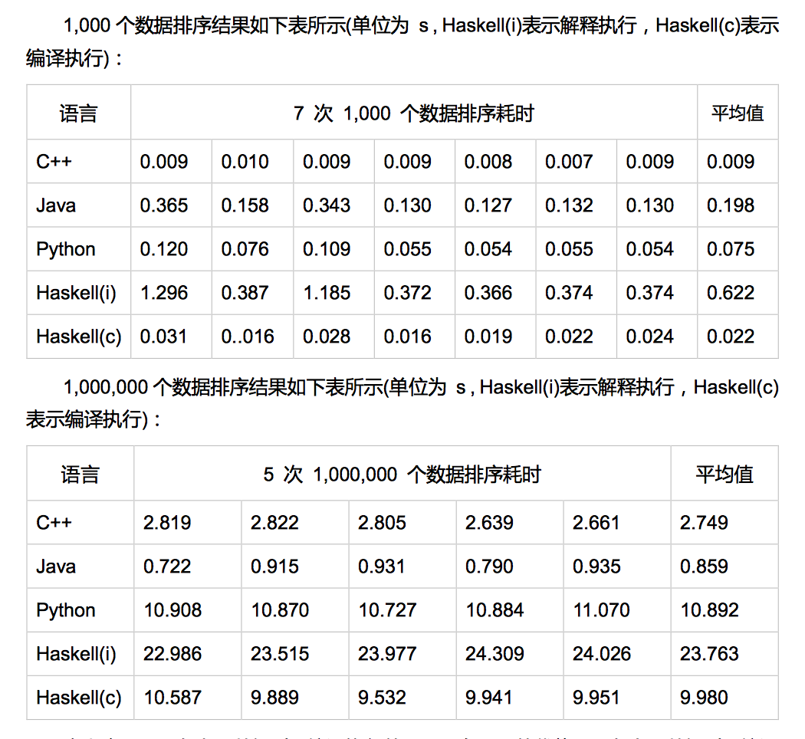

# Compiler
Compilation course project.

Use C++, Java, Python and Haskell implement Merge Sort, and compare these languages' performance.

## Summary

Copyright © Gerry.

You can do any thing as you want.

