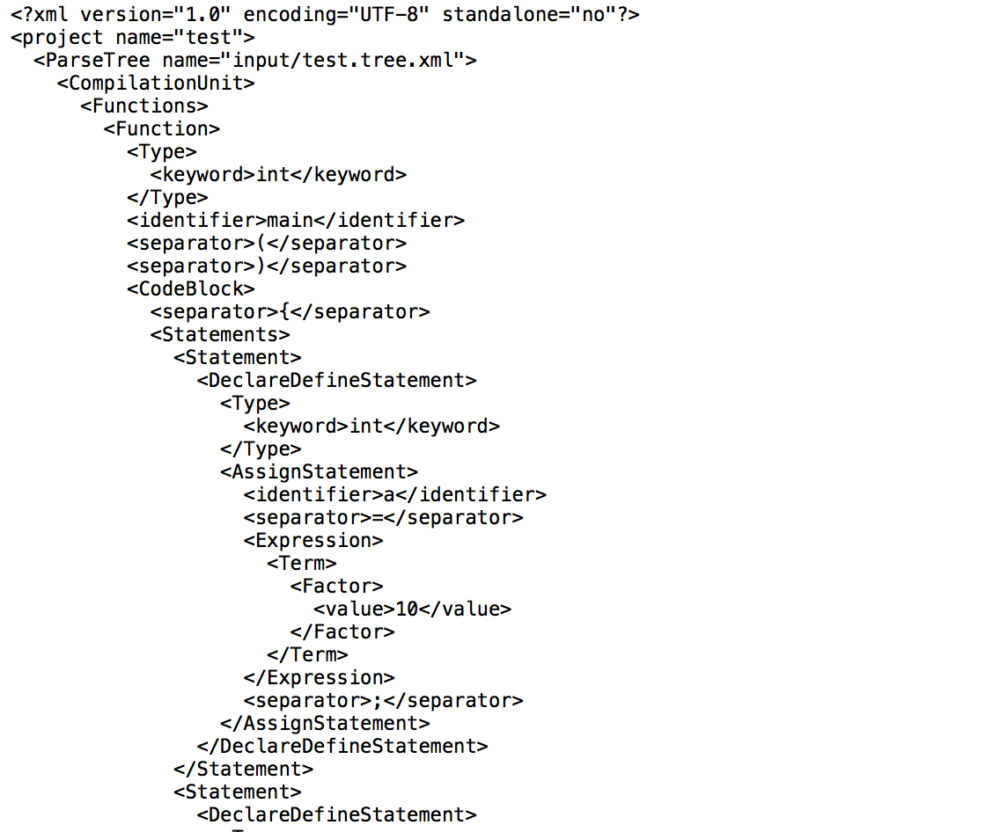

# Compiler
Compilation Principle course project.

## Languages cognition

Implement Merge Sort with C++, Java, Python and Haskell , and compare their performance.

## Lexical Analyzer

Implement a mini lexical analyzer with DFA, ouputing token stream as XML file.

## Syntax Analyzer

Implement a mini syntax analyzer with recursive descent method, outputing parse tree as XML file.

## Code Generator

Implement a mini code generator (X86 or MIPS assembly).

C:

MIPS:

## Summary

It's an initial attempt in the field of compilers ...

## License

Copyright © Gerry.

You can do anything as you want.

